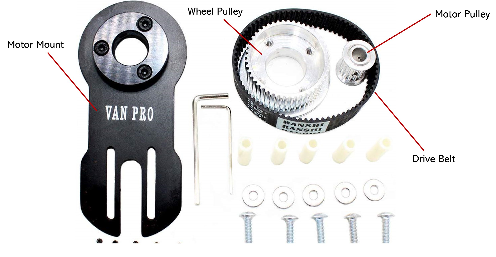
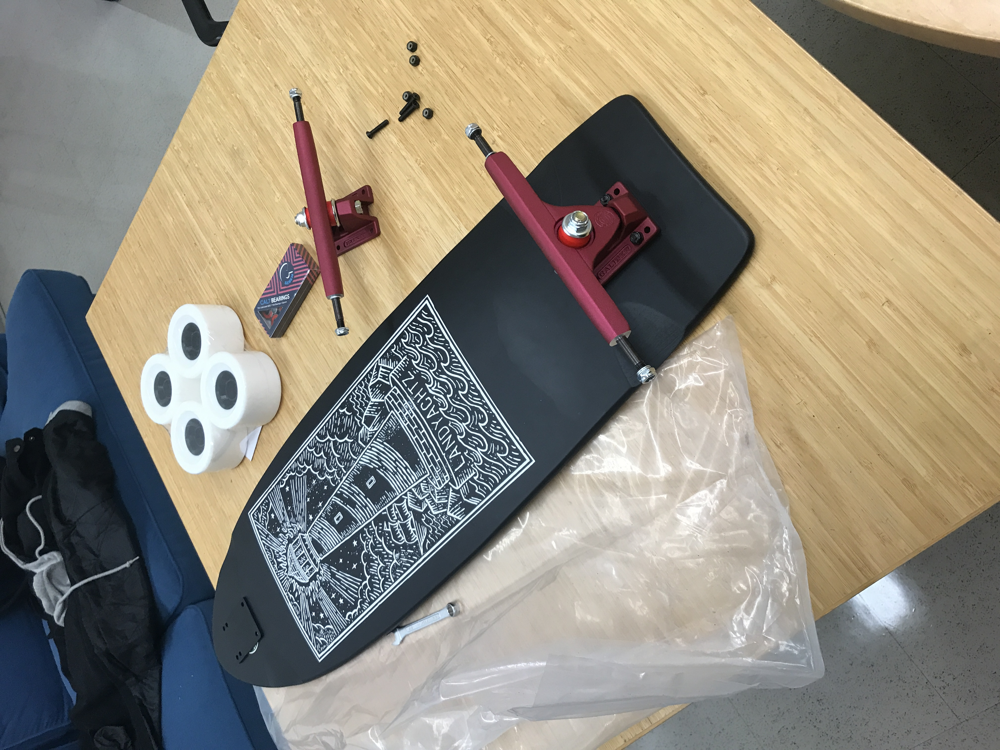

# lab64 Motorized Board Association

Welcome! If you're here, you're probably interested in building your own electric skateboard. Whether you're a seasoned maker or a newbie, we'll help guide your way to building your very own motorized board.

Feedback is always appreciated! Please send any questions, comments, or suggestions to <chtsao@stanford.edu>.

For code related questions, please post to the [issues tab](https://github.com/chtsao8/lab64-MBA/issues).

**_Please always wear a helmet when testing/riding._**

### Table of Contents:

|  Difficulty Level | Type of Board  |
| :-------- | :----------------- |
 Level 0 | [The Basic Board](#level-0-the-basic-board) |
 Level 1 | [Single Drive Motorized Board](#level-1-the-basic-motorized-board) |
 Level 2 | [Hub Drive Motorized Board](#level-2-hub-driven-motorized-board) |
 Level 3 | [Advanced Motorized Board](#level-3-advanced-motorized-board)|
 Level 4| [Autonomous Motorized Board](#level-4-autonomous-motorized-board) |

# Level 0: The Basic Board
Before diving into building your own motorized board, it is vital that you understand the workings of a normal skateboard. Simply put, a skateboard is a plank of wood with 4 wheels attached to it that a person rides using their feet to guide and accelerate.

More accurately: Skateboards consist of three primary parts: the deck, the trucks, and the wheels.

 Image credits: SkatePro, https://www.skatepro.uk/a535.htm

## The Deck
Decks are the backbone of the board. Standard skateboard decks are between 28-33 inches. You may have heard of other types of boards too - Penny-boards are between 20-23 inches, Nickel-boards are around 27 inches, and longboards are usually over 36 inches up to 60 inches long. Longboards are typically used for higher speed and cruising, so they're the most reasonable choice for building your first motorized board. 

For the rest of this guide, I'll mostly focus on longboards. There are 3 things you want to look out for when buying a deck:
1. **Wheelbase** - The wheelbase is the distance between the two inner truck mounting holes of a board (we'll talk more about this later). If you're building a longboard, you won't have to worry about the wheelbase, but for shorter boards, make sure you have at least 17.7 inches (450mm) of wheelbase - 4.7 inches for the motor, 2 inches forwire routing, and 11 inches for the batteries. 
2. **Deck Flex** - Pretty self explanatory. If you're planning on building a motorized board, I'd highly recommend you get a stiff deck since flexible decks can cause the electronics to hit the ground while riding.
3. **Deck Shape** - There are a lot of deck shapes that you should read up about on this website: [Choosing a Longboard Deck](https://www.warehouseskateboards.com/help/Longboard-Skateboard-Decks-Buying-Guide)

The deck shape is part preference, part practical. For the purposes of building a motorized board, I'd recommend getting a deck with a progressive or tub concave curve and minimal rocker curve. You want to make sure the bottom of the board isn't too curvy, or the electrical components (especially the battery) won't sit flush with the deck and could potentially get scratched or damaged if they're not secure.

Additionally, you have the option of putting **grip tape** on the top of your deck. The increase in friction between the board and your feet helps minimize the chances of you slipping off of your longboard and eating concrete.

**Here's an example of a good deck:**

  

Here's some pretty solid decks you can get online for around $100-200:

[LandyYachtz Cannon Arrow Lighthouse](https://www.muirskate.com/longboard/decks/72888/2018-landyachtz-canyon-arrow-lighthouse-longboard-skateboard-deck-w-grip)

[Truncated Tesseract](https://loadedboards.com/collections/longboard-decks-and-completes/products/truncated-tesseract-longboard-skateboard) (expensive!)

[Cantellated Tesseract](https://www.amazon.com/Loaded-Boards-Cantellated-Tesseract-Skateboard/dp/B075NNCD2X/ref=as_li_ss_tl?ie=UTF8&qid=1530370286&sr=8-1&keywords=cantellated+tesseract&dpID=514TN0u%252Bs4L&preST=_SY300_QL70_&dpSrc=srch&linkCode=sl1&tag=ddventures08-20&linkId=5564b9d6b2f3b08582bd1e785c37dc0c) (expensive!)

Otherwise, we can go to the [skate shop](http://skateworks.com/) to grab a longboard (or other-board) deck.

## The Trucks

As seen in the picture at the top, trucks are the parts of the board that connect the deck to the wheels. They're usually made of aluminum alloy. Here's a well labeled image of the components of the truck:

The bottom part of the truck is called the baseplate, and attaches directly to the deck. Above it is the (T-shaped) hanger, which the axle runs through. Between the baseplate and hanger, there are polyurethane bushings that cushion the turning of the skateboard. All of these parts are in place by the kingpin nut. Finally, the pivot (not shown, behind hanger on baseplate) directs the turning of the hanger.

There are two types of skateboard trucks - the reverse kingpin, and regular kingpin trucks. Longboards typically use reverse kingpin trucks for more stability and control, so I'd personally get those, but the choice is up to you.

 

Standard longboard trucks range from 150mm to 180mm, but for the purposes of a motorized board 218mm trucks are also an option. The 180mm trucks will alow for **easier handling and speed**, but the 218mm trucks are **more stable and allow more space for motor and electrical components at the cost of handling**. 

Be aware that there are two main brands of longboard trucks: Paris trucks, which have round hangers, and Caliber II trucks, which have rectangular hangers. The difference will come into play when [choosing your motor mount](#motor-and-motor-mount), so keep this in mind when purchasing trucks.

You can get skateboard trucks online at around $30 at these links:

[Zumiez](https://www.zumiez.com/skate/trucks/longboard-trucks.html)

[MuirSkate](https://www.muirskate.com/longboard/trucks/all)

[Caliber Trucks (recommend!)](https://www.amazon.com/gp/product/B00NY3Q5Q8/ref=ppx_yo_dt_b_asin_title_o09__o00_s00?ie=UTF8&psc=1)

[Amazon](https://www.amazon.com/s?k=longboard+trucks&ref=nb_sb_noss_2)

Or maybe we could go to the skate shop.

## The Wheels

Finally the wheels. This is potentially the most flexible part of the board build. They're typically made of polyurethane and have tons of sizes and styles. Around 65-75mm diameter is the most common for longboards, but for electric skateboards, we're going to want to have 80-97mm wheels for stability (and so you don't eat concrete when hitting things on the road). Larger wheels go faster at the expense of torque and acceleration, and vice versa, but we'll go into depth about this in **Level 1**.

Wheels also are measured by durometer ratings; longboards are on the softer side (75-85aa) for smoother rides compared to smaller skateboards (90-100aa). 

[Cal 7 Wheels](https://www.amazon.com/Cal-Cruiser-Skateboard-Longboard-Flywheel/dp/B0752ZQPHJ) - 
Here are some really nice and cheap ($30) 97mm longboard wheels. Notice the small wheel shaped metal objects in the image above. Those are wheel bearings that allow the wheel to spin on the axle of the trucks. There's usually two in each of the four wheels.

[All Terrain Wheels](https://www.amazon.com/MBS-All-Terrain-Longboard-Wheels-Orange/dp/B074DG2K97/ref=asc_df_B074DG2K97/?tag=hyprod-20&linkCode=df0&hvadid=312154671095&hvpos=1o5&hvnetw=g&hvrand=11996070871666925470&hvpone=&hvptwo=&hvqmt=&hvdev=c&hvdvcmdl=&hvlocint=&hvlocphy=9031970&hvtargid=aud-829758849484:pla-521024198533&psc=1) - 
Alternatively, you can get _all terrain_ longboard wheels. If you're planning on riding through dirt and sand (not sure why you would though) or want a potentially smoother ride, consider using these.

Like the other parts, wheel choice is personal preference. We'll have multiple styles of wheels (street, all-terrain, diff. sizes) available in lab64 for you to test out before you decide on a purchase.

### Assembly:
Assembly is fairly straightforward. If you need help, here are some useful links:

How to assemble a top mount: https://www.thelongboardstore.com/blog/diy-how-to-assemble-a-top-mount/

Video: https://www.youtube.com/watch?v=0sB8zbV0abg

***And that's all for building your very own (long/other)board!*** When you're comfortable with your ride, you can move on to **Level 1** and motorize your board.
\
\
 ***Note:*** if you're interested in how the parts of the deck, wheels and shaft are made, or even dedicated to _building a board from scratch_, here's a website link detailing [how the parts of skateboards are made](http://www.madehow.com/Volume-6/Skateboard.html)

# Level 1: The Basic Motorized Board

 ***Note:*** this section heavily references [this article](https://www.electric-skateboard.builders/t/beginners-guide-to-building-your-own-electric-skateboard-drivetrain/53) by user **onloop**. Big thanks to him for the knowledge.

Now that we have the basic board, it's time to motorize it! Turning your board into a motorized board requires three big components:
1. The Drive Train
2. The ESC (Electric Speed Controller) / Remote
3. The Batteries / BMS and accessories

Here's a schematic of all the parts that go into motorizing your board.

## The Drive Train
Motorizing the wheels requires that we build the **drive train**, which consists of the following parts:

1. The Motor Mounting Plate and Motor
2. The Wheel Pulley
3. The Motor Pulley
4. The Drive Belt

All seen here:

And combined here:

This section will be focused on the math and engineering behind making the **drive train** for the motorized board. 

### Motor and Motor Mount
We'll start with the motor mounting plate, which looks like this:

 Image credits: HobbyKing, https://hobbyking.com/en_us/motor-mount-5.html

The motor mount is the backbone of the electronic components. The disjointed right side of the motor mount is where you attach the mount to the hanger/axles of the trucks. They're secured tight with screws. The left side is where the motor is secured. All the motor mounting plates I've seen have been made out of aluminum, since it's light and strong. I talked earlier about two brands of trucks - again, Paris (round) and Caliber II (rectangular) trucks. **Absolutely make sure** that you choose a motor mount that is compatible with your trucks! You want to see if the truck attaching side is round or rectangular.

You can buy a good motor mount here for cheap:

[HobbyKing Motor Mount](https://hobbyking.com/en_us/motor-mount-5.html) (Fits Caliber II Trucks)

find mounts online, or machine one yourself (see [Making Your Own Parts](#making-your-own-parts)). Try creating a better design!

Next up is the motor. You might've seen the terms "brushed" and "brushless" motors around. If you're not concerned with the differences, skip this section, but if you're curious, read on.

**Brushed Motors** have a rotating set of wound wire coils (armature) on their rotor that act as an electromagnet with two poles. Brushed motors utilize a mechanical rotary switch called a _commutator_ which is in direct contact with _brushes_ that provide current from the battery. This commutator reverses current flow twice every cycle so that the electromagnet is pulled and pushed by the magnets on the outside of the rotor (stator). Inertia keeps the rotor moving in its desired direction while this magnetic pushing and pulling occurs. Brushed motors have poor heat dissipation and less rotational efficiency than brushless motors due to the friction between the commutator and brushes, but are cheaper.

**Brushless Motors** kind of flip the components of a brushed motor. By utilizing a permanent magnet as its rotor, and having the wound wire coils on the stator of the motor, this eliminates the need for brushes and a commutator. The wound wire coils (typically 3) are activated one phase after another as directed by an electronic speed controller and signals from a _Hall sensor_ tracking the position of the rotor in order to control the motor's rotation.

Here's an image to help understand Brushed vs Brushless motors:

For the purposes of our motorized board, we'll want to stick to a ***brushless motor***, which is pretty standard for motorized boards. The brushless motor will be more reliable due to its frictionless drive.

What kV rating should a motor have? First, a motor's kV rating is RPM per volt. Basically, if you multiply a motor's kV rating by a battery's voltage, you'll get the RPM. With a higher kV rating, you'll get less torque but a higher top speed, and with a lower kV rating, you'll get more torque but a lower top speed. Stick with a motor in between 180kV-270kV.

Here are some motors, around $80: 

[Brushless 245kV Motor](https://www.hobbypartz.com/96m608-bigfoot160-5335-245kv.html)

[Brushless 190kV Motor w/Pulley](https://flipsky.net/products/copy-of-bldc-belt-motor-6374-190kv-3250w-for-electric-skateboard?variant=29546115006524)

[Brushless 200kV Motor](https://flipsky.net/products/motor-h5045?variant=21870270840892)

### Wheel and Motor Pulleys

Next we'll focus on the pulleys. These are the gear-shaped objects that connect the motor to the wheels. The wheel pulley is secured with screws to the spokes of the board's wheels, and the motor pulley attaches straight onto the motor. Pulleys come in different shapes, sizes, and teeth count.

So what type of pulleys should we buy? The wheel diameter and motor kV rating, parts we've previously discussed, will help a lot with choosing the right pulleys. What we need to find now is the **gearing reduction ratio**, which is **speed of driven/speed of driver**, in our case the wheel and the motor (attached to the wheel and motor pulleys respectively). Additionally, we want to ensure we have good **torque** transfer between the motor and the wheels.

To do so, we have to consider several variables. First off, be aware that there are different _widths_ of pulleys and pulley belts, ranging typically from 5mm-50mm. The wider the pulleys/belts are, the less likely they will be to slip or disconnect from each other. For the purposes of the motorized board, we want to get pulleys and belts with a width between 12mm-17mm. 17mm is preferable, but if there isn't enough space under your board then 12mm works as well.

Another variable is the **bore** of the motor pulley. This refers to the inner hole of the pulley that the motor shaft connects to. There are two shapes of bore: D-shaped, and round, and different inner diameters.  The most typical sizes that you'll run into will be 8mm or 10mm, but double check the shape and size of the pulleys you're purchasing to ensure they're compatible with your motor.

Here's a 12mm round bore pulley vs a 12mm D-shaped bore pulley. Notice the holes in the teeth of the pulley - this is where the _key_ goes in, a piece that secures the pulley to the motor shaft to prevent slipping:

 

 Image credits: Amazon, https://www.amazon.com/uxcell-Aluminum-8mmx7mm-D-Shape-Timing/dp/B0747H4J39. ElectricBoardSolutions, https://electricboardsolutions.com/products/12mm-wide-15t-motor-pulley.

Next would be the number of teeth engaged with the belt at any given time. This is called the number of **teeth-in-mesh**. In order to ensure minimal loss between the motor and the wheel, we want to ensure we have at least _6_ teeth or more in mesh at any given time (per pulley). This would mean we need at least 13 teeth on the motor pulley and 36 teeth on the wheel pulley. We can calculate the **gearing reduction ratio** from the teeth ratio of the motor and wheel pulleys - just take the teeth count on the larger pulley and divide by the teeth count on the smaller pulley. For example, if we had 12 teeth on the motor pulley and 36 teeth on the wheel pulley, our gearing reduction ratio would be 36:12 = 3:1 ratio. This means that the motor pulley makes 3 full rotations for each full rotation on the wheel pulley.

You can probably tell now that decreasing the gearing reduction ratio will increase the top speed, as there will be more turns of the wheel pulley per turn on the motor pulley, but this will lower the torque transfer as the motor needs to work harder. Increasing the gearing reduction ratio will increase torque transfer at the cost of top speed. Play around with different motor (13-17t) and wheel (32-40t) sizes and see what works best. 

Whew! That was a lot of variables for the pulleys. Again, play around with all of the variables above to see what gives you the most comfortable configuration for your motorized board. Here are some pulleys that you can buy:

[15T 16W Motor Pulley from eBay](https://www.ebay.com/itm/HTD-5M-15T-16W-5-6-6-35-8-10mm-Bore-Pitch-5mm-Timing-Belt-Drive-Pulley-15-Tooth-/252402866384)

[15T 16W Motor Pulley from Flipsky](https://flipsky.net/collections/accessories/products/flipsky-d-shape-motor-pulley-electric-skateboard-aluminium-motor-gear)

[Longboard Wheel Pulley (various sizes)](https://www.ebay.com/itm/Eletric-Skateboard-Longboard-Wheel-Pulley-For-5M-36T-40T-44T-ABEC-Flywheels-Part/273863867143?_trkparms=ispr%3D1&hash=item3fc38efb07:m:mfSVOdjGxd1P0Y0o7nfw6tg&enc=AQAEAAACQBPxNw%2BVj6nta7CKEs3N0qU998HX1NeuR8oovgN8i6Lv%2FWJ9SmsQovssTbeSfl4QmxdOEMKKvhVgcugj%2FB%2F7GHCpcacQ3oCxMU405BMOn4nWJMkmTJdAsqpU3lem2B02KuHd6Q2Z%2BglSjG4dWq2fgA0szySP7csqbGlQNtsPmwIyuOl4TBlBWChYRSfevfRNfl7q4mWaZBssX06qePGz7FG4A7b3VMl0%2BRm9%2FFX3nDggPQ%2Bvdg9KFfKILO%2B4gRHdJ0Ra%2FKbs5TJEmDI8I4eOLMzj4nD4MQoVF17Ei%2F%2BnIdz3TqciG2INGWNb9Zewjj3RJ1yPDof9x1aFVjUUAcUk1Yu4ZXTk%2FPf4pJXPzk4a2owaCkyLJahAzZXJvqAOktbQTayfAoS%2B5l%2BfJEULYXqswkR6YIMm1OjqrMEIol1Pj7MzY2%2BXyK091GGlkyWI%2FEF3iqSlm0vr0fYktX0bXNRRtlcmzc%2BR9Uuhr%2BLJhcoT%2F0p%2FuEur3u44%2FX4YaTleR0%2F2d1IF5HVrCXQPGC3mL5cUOICDuIXPZDn8pH%2Bf6lINGwh6AnCYw3vuCFtz9SEOBtvmk06zzFU9vkQRyye5NRrTiqHdHX%2FPbE0rBoRo9c8uHIryjej86KNo3bAUQ1DQE9WqKK0evduFKfK%2FTN8TzNxZc8As6qKoMGRnP%2FwpZXQOWXqueyUvxzeucTkY9Oe8VtB0kXWuuKGP6bipFwH%2B6zeC7SKGgonSQhYSCcqiOV5Y62%2B5x5bWBQAea%2FdZFyLwrSmVsg%3D%3D&checksum=273863867143b6104c74f3c544d182310540bc123137&enc=AQAEAAACQBPxNw%2BVj6nta7CKEs3N0qU998HX1NeuR8oovgN8i6Lv%2FWJ9SmsQovssTbeSfl4QmxdOEMKKvhVgcugj%2FB%2F7GHCpcacQ3oCxMU405BMOn4nWJMkmTJdAsqpU3lem2B02KuHd6Q2Z%2BglSjG4dWq2fgA0szySP7csqbGlQNtsPmwIyuOl4TBlBWChYRSfevfRNfl7q4mWaZBssX06qePGz7FG4A7b3VMl0%2BRm9%2FFX3nDggPQ%2Bvdg9KFfKILO%2B4gRHdJ0Ra%2FKbs5TJEmDI8I4eOLMzj4nD4MQoVF17Ei%2F%2BnIdz3TqciG2INGWNb9Zewjj3RJ1yPDof9x1aFVjUUAcUk1Yu4ZXTk%2FPf4pJXPzk4a2owaCkyLJahAzZXJvqAOktbQTayfAoS%2B5l%2BfJEULYXqswkR6YIMm1OjqrMEIol1Pj7MzY2%2BXyK091GGlkyWI%2FEF3iqSlm0vr0fYktX0bXNRRtlcmzc%2BR9Uuhr%2BLJhcoT%2F0p%2FuEur3u44%2FX4YaTleR0%2F2d1IF5HVrCXQPGC3mL5cUOICDuIXPZDn8pH%2Bf6lINGwh6AnCYw3vuCFtz9SEOBtvmk06zzFU9vkQRyye5NRrTiqHdHX%2FPbE0rBoRo9c8uHIryjej86KNo3bAUQ1DQE9WqKK0evduFKfK%2FTN8TzNxZc8As6qKoMGRnP%2FwpZXQOWXqueyUvxzeucTkY9Oe8VtB0kXWuuKGP6bipFwH%2B6zeC7SKGgonSQhYSCcqiOV5Y62%2B5x5bWBQAea%2FdZFyLwrSmVsg%3D%3D&checksum=273863867143b6104c74f3c544d182310540bc123137)

Look around online for different motor and wheel pulleys - you can find them easily on eBay or Amazon.

### Drive Belt
The drive belt connects the motor pulley to the wheel pulley. Choosing a drive belt is partially dependent on your motor mount's length, but since most motor mounts are approximately around 8 inches from the center of the trucks to the motor's axle, the typical drive belts for a motorized board are all around the same size. Thus, you just want to select a belt that can be reasonably tensioned between the two pulleys. The most standard drive belt I've found online and used by others is the HTD 255-5M timing belt. 

You can get one here:

[HTD 255-5M Timing Belt 51 Teeth](https://vbeltoutlet.com/htd-255-5m-timing-belt-51-teeth.html/)

### Assembly
Assembly of the drive chain may be a bit tricky if your parts don't fit together perfectly, so make sure you order parts or make parts that are compatible with each other, or else you'll be doing a lot of physical labor to get your parts to fit.

To mount the wheels and wheel pulley, it's possible you'll have to cut of a section of your trucks to expose more axle. If you're lucky, you won't have to do this

### Making your own parts

## The ESC/Remote
50 amps

VESC

[remote](https://www.aliexpress.com/item/32968018318.html?spm=a2g0o.detail.1000014.3.73881a5frJ7NTL&gps-id=pcDetailBottomMoreOtherSeller&scm=1007.13338.146400.0&scm_id=1007.13338.146400.0&scm-url=1007.13338.146400.0&pvid=2458bff6-fce8-4dfa-8427-6e4a5219a875)

## The Batteries

# Level 2: Hub-driven Motorized Board

# Level 3: Advanced Motorized Board

# Level 4: Autonomous Motorized Board
